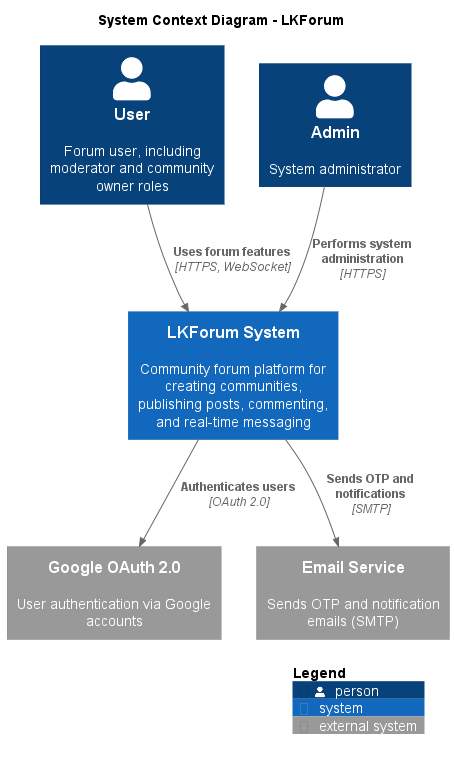
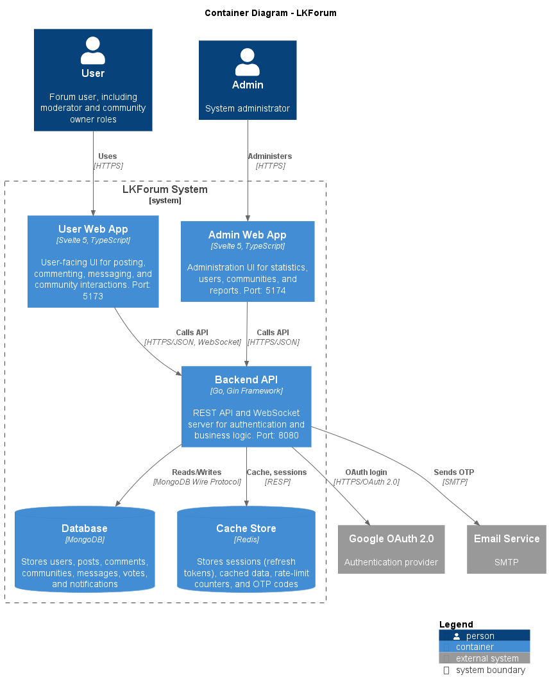
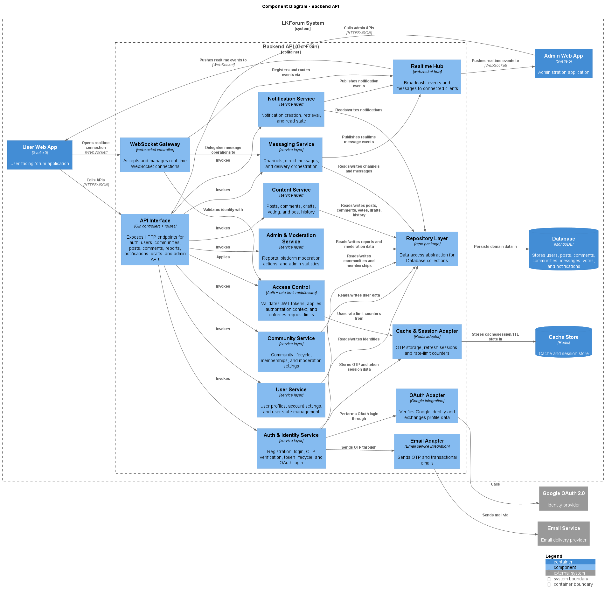

# LKForum

Community Social Network LKForum is a website that provides a comprehensive, modern solution for building and managing online communities.

## C4 Architecture

### 1. System Context



### 2. Container



### 3. Component (Backend)



## Project structure

```text
lkforum/
├─ backend/                 # Go + Gin API, business logic, WebSocket hub
│  ├─ internal/
│  │  ├─ bootstrap/         # Dependency wiring and startup
│  │  ├─ config/            # App/env configuration
│  │  ├─ controller/        # HTTP/WebSocket handlers
│  │  ├─ service/           # Domain/business logic
│  │  ├─ repo/              # MongoDB data access
│  │  └─ route/             # API route registration
│  └─ cmd/                  # Utility scripts (seed admin, migrations, cleanup)
├─ frontend/
│  ├─ user-web/             # End-user SPA (Svelte + Vite)
│  └─ admin-web/            # Admin SPA (Svelte + Vite)
├─ docs/
│  └─ c4-diagrams/          # C4 architecture diagrams
└─ docker-compose.yml       # Local multi-service runtime
```

## How to run

### Option 1: Docker Compose

From repository root:

```bash
docker-compose up --build
```

Services and URLs:

* **Backend API**: `http://localhost:8081` (container port 8080)
* **User web**: `http://localhost:3001`
* **Admin web**: `http://localhost:3004`
* **Redis**: internal container service

> `docker-compose.yml` reads environment variables from `backend/.env`.

### Option 2: Run locally (dev mode)

Prerequisites:

* Go 1.25+
* Node.js 20+ and npm
* Redis
* MongoDB (local or Atlas)
1. **Backend**

```bash
cd backend
go run main.go
```

2. **User web**

```bash
cd frontend/user-web
npm install
npm run dev
```

3. **Admin web**

```bash
cd frontend/admin-web
npm install
npm run dev
```

Default local ports:

* Backend: `8080`
* User web: `5173`
* Admin web: `5174` (Vite default)

## Environment configuration

Backend loads variables from `backend/.env`. Key groups:

* App/runtime: `PORT`, `ALLOWED\_ORIGINS`, `FRONTEND\_URL`
* Database/cache: `MONGO\_URI`, `DB\_NAME`, `REDIS\_ADDR`, `REDIS\_PASSWORD`, `REDIS\_DB`
* Auth: `JWT\_SECRET`, `JWT\_ISSUER`, `JWT\_AUDIENCE`, token TTL variables
* Integrations: SMTP, Google OAuth, Cloudinary, Gemini moderation settings

