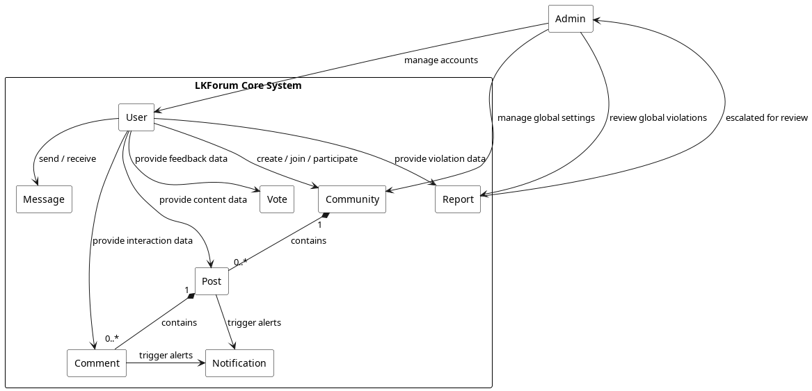
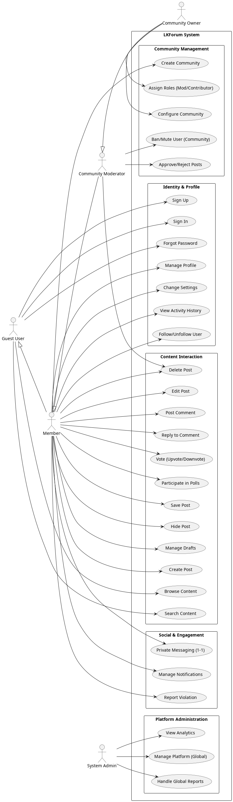

# BUSINESS REQUIREMENTS DOCUMENT - LKFORUM

**Version 1.0**  
**Date:** March 15, 2026  
**Status:** Draft

---

## 1. Objective and Scope

### 1.1. Project Objective
The primary objective of the LKForum project is to design and build a modern, scalable, and highly interactive community platform. Unlike general social networks, LKForum focuses on **autonomous community management**, allowing users to create, configure, and moderate their own niche sub-forums (Communities).

The development focuses on delivering a high-quality system that ensures:
- High performance for real-time interactions, including Instant Messaging and Notifications.
- Superior scalability to handle a large and growing number of concurrent communities and users.
- Robust moderation capabilities, integrating both automated (AI-assisted) and manual review processes.
- High standards for security and data privacy to protect user information and platform integrity.

### 1.2. Project Scope

The project scope includes the following modules:

- **Identity & Access Management:** Multi-factor authentication, SSO, and granular role-based access control.
- **Community Management:** Creation, configuration (public/private/18+), rule-setting, and membership handling.
- **Content Management:** Multi-format posts (text, image, video, poll), nested comments, and draft management.
- **Engagement System:** Real-time voting (upvote/downvote), saved posts, and activity history.
- **Communication Suite:** Real-time 1-1 messaging via WebSockets and an instant notification system.
- **Moderation & Governance:** Report handling, user banning/muting, and content approval workflows.
- **Administration Dashboard:** Global system oversight, analytics, and platform-wide moderation.

---

## 2. Business Requirement

### 2.1. Application Overview

LKForum is a community-driven social network. It is structured around "Communities" (sub-forums).

- **Users** can discover and join communities based on interests.
- **Content** is categorized by communities, ensuring relevant discussions.
- **Decentralized Moderation:** Each community has its own set of rules and a dedicated moderation team (Owners/Mods), reducing the burden on global administrators.
- **Real-time Experience:** The platform feels "alive" through instant feedback, live messaging, and notifications.

### 2.2. Domain Model

#### 2.2.1. Domain Diagram (Conceptual)

#### 2.2.2. Domain Objects Description

| #   | Object Name      | Object Description                                                        |
| --- | ---------------- | ------------------------------------------------------------------------- |
| 1   | **User**         | A registered identity with a profile, karma points, and activity history. |
| 2   | **Community**    | A niche hub with specific topics, rules, and privacy settings.            |
| 3   | **Post**         | Content shared within a community (Text, Image, Video, or Poll).          |
| 4   | **Comment**      | A response to a post, supporting nested/threaded replies.                 |
| 5   | **Vote**         | An expression of approval (Upvote) or disapproval (Downvote) on content.  |
| 6   | **Message**      | Direct communication content between users in a 1-1 chat.                 |
| 7   | **Notification** | Real-time alerts for replies, mentions, votes, or system messages.        |
| 8   | **Report**       | A user-generated complaint about content or behavior violating rules.     |

### 2.3. Workflow (Key Business Processes)

#### 2.3.1. Content Lifecycle & Moderation Workflow

1. **Creation:** A user creates a post in a community.
2. **AI Screening:** The system automatically checks content for prohibited keywords/media.
3. **Approval (Optional):** If the community requires "Post Approval," the post is held in a _Pending_ state.
4. **Moderation:** A Moderator/Owner reviews the post (Approve or Reject).
5. **Publication:** Once approved (or if no approval is required), the post becomes public and triggers notifications to members.

#### 2.3.2. Community Management Workflow

1. **Setup:** A user creates a community (becomes the Owner).
2. **Configuration:** Owner sets rules, privacy (Public/Private), and invites Moderators.
3. **Governance:** Owners/Mods monitor reports and can ban/mute users or remove content.

### 2.4. Use Cases and Actors

#### 2.4.1. Diagram

#### 2.4.2. Description of Actors

| #   | Actor Name              | Definition                                                                      |
| --- | ----------------------- | ------------------------------------------------------------------------------- |
| 1   | **Guest User**          | Unauthenticated user; can browse public content and search.                     |
| 2   | **Member**              | Authenticated user; can post, comment, vote, and message.                       |
| 3   | **Community Moderator** | Member with management rights in a specific community (Approve/Delete content). |
| 4   | **Community Owner**     | Creator of a community; can appoint moderators and change settings.             |
| 5   | **System Admin**        | Global administrator responsible for platform-wide health and safety.           |

#### 2.4.3. Description of Use Cases

| #   | Use Case Name             | Definition                                                                               |
| --- | ------------------------- | ---------------------------------------------------------------------------------------- |
| 1   | **Sign Up**               | Users create a new account by providing email, username, and password, verified via OTP. |
| 2   | **Sign In**               | Authenticated access using credentials or linked Google OAuth account.                   |
| 3   | **Forgot Password**       | Users reset their password through email verification (OTP).                             |
| 4   | **Manage Profile**        | Users update personal information, including bio, avatar, and cover image.               |
| 5   | **Change Settings**       | Users configure account preferences (privacy, notifications, theme).                     |
| 6   | **View Activity History** | Users review their past posts, comments, and interactions.                               |
| 7   | **Follow/Unfollow User**  | Users subscribe to another user's activity feed.                                         |
| 8   | **Browse Content**        | Users explore communities and view public posts without necessarily logging in.          |
| 9   | **Search Content**        | Users search for specific keywords, posts, users, or communities.                        |
| 10  | **Create Post**           | Members publish new content (Text, Image, Video) within a selected community.            |
| 11  | **Edit Post**             | Members modify the content of their existing posts (stores edit history).                |
| 12  | **Delete Post**           | Members or Moderators remove posts from public view (soft delete).                       |
| 13  | **Post Comment**          | Users add a response directly to a post.                                                 |
| 14  | **Reply to Comment**      | Users respond to an existing comment (supporting nested threads).                        |
| 15  | **Vote on Content**       | Users express approval (Upvote) or disapproval (Downvote) on posts/comments.             |
| 16  | **Participate in Poll**   | Users cast votes in community-created polls.                                             |
| 17  | **Save Post**             | Users bookmark posts for quick access later.                                             |
| 18  | **Hide Post**             | Users hide specific posts from their personal feed.                                      |
| 19  | **Manage Drafts**         | Users save unfinished posts as drafts and resume editing later.                          |
| 20  | **Private Messaging**     | Users send and receive instant 1-1 messages via WebSocket.                               |
| 21  | **Manage Notifications**  | Users view and clear real-time alerts for engagement and system updates.                 |
| 22  | **Report Violation**      | Users flag inappropriate content or behavior for moderator review.                       |
| 23  | **Create Community**      | Users establish a new niche forum and become the "Owner."                                |
| 24  | **Approve/Reject Post**   | Moderators review pending posts before they appear in the community.                     |
| 25  | **Ban/Mute User**         | Moderators restrict a user's ability to participate within a community.                  |
| 26  | **Configure Community**   | Owners adjust rules, privacy settings, and appearance of their community.                |
| 27  | **Assign Roles**          | Owners appoint other members as Moderators or Contributors.                              |
| 28  | **Handle Global Reports** | System Admins review and act on platform-wide violation reports.                         |
| 29  | **Manage Platform**       | System Admins ban/unban users or communities globally.                                   |
| 30  | **View Analytics**        | System Admins monitor platform statistics (DAU, growth, content volume).                 |

### 2.5. Security Matrix

| # | Function | Guest | Member | Mod | Owner | Admin |
|---|---|:---:|:---:|:---:|:---:|:---:|
| 1 | Sign Up / Sign In / Forgot Password | X | X | X | X | X |
| 2 | Manage Profile & Settings | | X | X | X | X |
| 3 | Follow / Unfollow User | | X | X | X | X |
| 4 | Browse Public Content & Search | X | X | X | X | X |
| 5 | View Own Activity History | | X | X | X | X |
| 6 | Create Post / Comment / Reply | | X | X | X | X |
| 7 | Edit / Delete Own Content | | X | X | X | X |
| 8 | Vote / Participate in Polls | | X | X | X | X |
| 9 | Save / Hide Post / Manage Drafts | | X | X | X | X |
| 10 | Send/Receive Private Messages | | X | X | X | X |
| 11 | Receive Notifications | | X | X | X | X |
| 12 | Report Violations | | X | X | X | X |
| 13 | Create New Community | | X | X | X | X |
| 14 | Approve / Reject / Pin Posts | | | X | X | X |
| 15 | Delete Any Post (In Community) | | | X | X | X |
| 16 | Ban / Mute User (In Community) | | | X | X | X |
| 17 | Configure Community Settings | | | | X | X |
| 18 | Assign Roles (Mod/Contributor) | | | | X | X |
| 19 | Handle Global Reports | | | | | X |
| 20 | Global User / Community Ban | | | | | X |
| 21 | View System Analytics | | | | | X |

### 2.6. User Story

#### 2.6.1. For Members
- **As a Guest User**, I want to **sign up with my email and verify via OTP** so that I can create a secure account on the platform.
- **As a Member**, I want to **sign in using my Google account** so that I can access the forum quickly.
- **As a Member**, I want to **customize my profile with a bio, avatar, and banner** so that I can express my identity.
- **As a Member**, I want to **save my posts as drafts** so that I can continue editing them later before publishing.
- **As a Member**, I want to **create posts with images and polls** so that I can share rich content.
- **As a Guest User**, I want to **search for specific keywords or communities** so that I can find content that interests me easily.
- **As a Member**, I want to **upvote or downvote posts and comments** so that I can help surface the most valuable content.
- **As a Member**, I want to **reply to specific comments in a threaded view** so that I can maintain structured conversations.
- **As a Member**, I want to **receive real-time notifications for replies and mentions** so that I can stay engaged.
- **As a Member**, I want to **follow other interesting users** so that I can see their latest activities in my feed.
- **As a Member**, I want to **send private messages to other users** so that I can have one-on-one conversations securely.
- **As a Member**, I want to **report inappropriate content** so that I can help maintain a safe community environment.

#### 2.6.2. For Community Owners & Moderators
- **As a Community Owner**, I want to **set specific rules and privacy settings** so that I can define how my community operates.
- **As a Community Moderator**, I want to **review and approve pending posts** so that I can ensure only high-quality content is published.
- **As a Community Owner**, I want to **assign moderator roles to trusted members** so that they can help me manage the community.
- **As a Community Moderator**, I want to **ban or mute disruptive users within my community** so that I can protect other members.

#### 2.6.3. For System Administrators
- **As a System Admin**, I want to **access a global dashboard with system analytics** so that I can monitor the overall health of the platform.
- **As a System Admin**, I want to **handle reports escalated from communities** so that I can take final action on serious violations.
- **As a System Admin**, I want to **perform global bans on malicious users or communities** so that I can keep the entire platform safe.

---

## 3. Appendix

### 3.1. Glossary

- **Karma:** A reputation score based on the net value of upvotes and downvotes received.
- **Sub-forum:** Synonymous with "Community" in LKForum.
- **SSO:** Single Sign-On (Google Authentication).
- **OTP:** One-Time Password sent via email for verification.

### 3.2. Open Issues

- Implementation of cross-posting (sharing posts across multiple communities).
- Automated AI moderation for image/video content (currently focusing on text).
- Integration of a global search engine (Elasticsearch).
